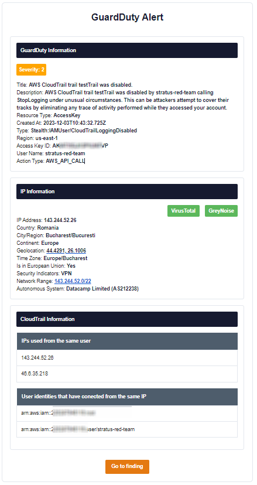

# GuardDutyInsightfulAlerts


## Overview
GuardDutyInsightfulAlerts is an AWS Lambda-based solution that enhances the alerting capabilities of AWS GuardDuty. It processes GuardDuty findings, enriches them with additional contextual information, and delivers well-structured email notifications, enabling users to make informed decisions upon receiving GuardDuty alerts.


## Motivation
While AWS provides [SNS-based notifications](https://docs.aws.amazon.com/guardduty/latest/ug/guardduty_findings_cloudwatch.html) for GuardDuty findings, these notifications often lack detail and context. GuardDutyInsightfulAlerts addresses this by offering richer, more informative alerts. Although it requires domain ownership for Amazon SES, which is an extra step compared to SNS, domains are inexpensive and easy to configure. This project also allows for customization and extension, such as adding more detailed information from GuardDuty events, executing additional queries, or integrating more data sources.

## Features
- **GuardDuty Event Processing**: Extracts and presents crucial information from GuardDuty findings.
- **IP Information Enrichment**: Optionally enriches alerts with detailed IP information (requires an optional free API key from [vpnapi.io](https://vpnapi.io/)).
- **CloudTrail Data Lake Querying**: Optionally augments alerts with historical data related to IPs or users by querying AWS CloudTrail Data Lake (requires the optional configuration of CloudTrail Data Lake in the AWS account).
- **Formatted Email Notifications**: Sends enriched findings as formatted emails for enhanced readability and quicker response.

## Modules
1. **GuardDuty Helpers**: Processes GuardDuty events.
2. **IP Helpers**: Gathers additional IP information.
3. **CloudTrail Helpers**: Utilizes CloudTrail Data Lake for historical data analysis.

## Prerequisites
- AWS Account with GuardDuty and Amazon SES enabled.
- (Optional) CloudTrail Data Lake for CloudTrail module functionality.
- (Optional) API key from [vpnapi.io](https://vpnapi.io/) for IP enrichment module.

## Terraform Deployment
The included Terraform scripts facilitate the Lambda function deployment along with the necessary AWS resources like CloudWatch rules.

## Usage
After deployment, the Lambda function automatically triggers upon GuardDuty findings. Depending on the configuration, it processes the events, enriches them with additional data, and sends out email notifications.

## Configuration
1. Set up the `shared.auto.tfvars.json` file with the following structure:
    ```json
    {
        "event_data_store": "arn:aws:cloudtrail:...:eventdatastore/...",
        "ses_identity": "arn:aws:ses:...:*",
        "vpnapi_key": "YourVpnApiKey",
        "destination_email": "recipient@example.com",
        "source_email": "sender@example.com"
    }
    ```
    - `ses_identity`, `destination_email`, and `source_email` are mandatory for SES email notifications.
    - `vpnapi_key` and `event_data_store` are optional and used for IP information and CloudTrail queries, respectively.

## Extensibility
The Lambda function is designed for flexibility. Users can modify it to include more detailed information from GuardDuty events, execute additional queries, or integrate more data sources.
